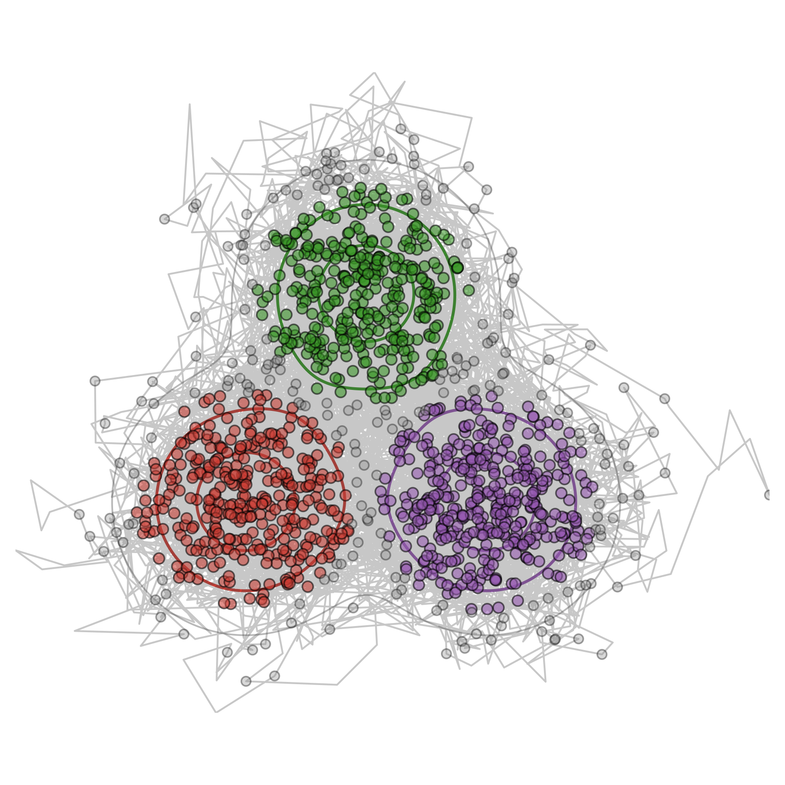

# MonteCarloX.jl

[](https://zierenberg.github.io/MonteCarloX.jl/dev)
[](https://github.com/zierenberg/MonteCarloX.jl/actions/workflows/CI_core.yml)
[](https://github.com/zierenberg/MonteCarloX.jl/actions/workflows/CI_examples.yml)
[](https://codecov.io/gh/zierenberg/MonteCarloX.jl)



MonteCarloX.jl is a concise, modular Monte Carlo framework in Julia.
It provides reusable sampling algorithms and measurement tools, while model-specific code lives in companion packages (for example, `SpinSystems`).

To install MonteCarloX.jl, run import Pkg; Pkg.add("MonteCarloX") as a Julia language command. 

## Design in one sentence

Build simulations from composable parts:

- `System` (state + observables)
- `LogWeight` / rates (target distribution or dynamics)
- `Algorithm` (how transitions are sampled)

Optional convenience layer:

- `Measurement` / `Measurements` (helpers for organized recording and schedules)

Only `System + LogWeight/rates + Algorithm` are required.

## Installation

### Core package

```julia
using Pkg
Pkg.activate(".")
Pkg.instantiate()
```

### Optional: SpinSystems (for Ising/Blume-Capel examples)

From repository root:

```julia
using Pkg
Pkg.develop(path="SpinSystems")
```

## Example 1: generic Metropolis sampling (no model package required)

This samples a 1D Gaussian target with custom log weight.
It uses `Measurements` for convenience; you can collect values manually instead.

```julia
using Random
using Statistics
using MonteCarloX

rng = MersenneTwister(42)

μ, σ = 1.0, 1.0
logweight(x) = -0.5 * ((x - μ) / σ)^2
alg = Metropolis(rng, logweight)

measurements = Measurements([
    :x => (x -> x) => Float64[]
], interval=1)

function update(x, alg)
    x_new = x + randn(alg.rng)
    return accept!(alg, x_new, x) ? x_new : x
end

x = 0.0
for step in 1:50_000
    x = update(x, alg)
    measure!(measurements, x, step)
end

println("acceptance rate = ", acceptance_rate(alg))
println("sample mean     = ", mean(measurements[:x].data))
println("sample std      = ", std(measurements[:x].data))
```

## Example 2: 2D Ising with Metropolis (requires SpinSystems)

This example also uses `Measurements` as optional convenience.

```julia
using Random
using Statistics
using MonteCarloX
using SpinSystems

rng = MersenneTwister(7)

sys = Ising([16, 16], J=1.0, periodic=true)
init!(sys, :random, rng=rng)

alg = Metropolis(rng; β=0.44)

measurements = Measurements([
    :energy => energy => Float64[],
    :magnetization => magnetization => Float64[]
], interval=16)

for step in 1:200_000
    spin_flip!(sys, alg)
    measure!(measurements, sys, step)
end

println("acceptance rate = ", acceptance_rate(alg))
println("⟨E⟩             = ", mean(measurements[:energy].data))
println("⟨|M|⟩           = ", mean(measurements[:magnetization].data))
```

## Documentation

The docs focus on pedagogy and examples:

- conceptual framework
- algorithm intuition (Metropolis, HeatBath, Multicanonical, Wang-Landau, Gillespie)
- measurement scheduling patterns
- broad set of runnable example patterns

Build locally:

```bash
julia --project=docs -e 'using Pkg; Pkg.instantiate(); include("docs/make.jl")'
```

Then open `docs/build/index.html`.

## Repository layout

- `src/`: core framework and algorithms
- `SpinSystems/`: optional model package
- `examples/`: notebooks and scripts (including stochastic-process and spin examples)
- `docs/`: Documenter source
- `test/`: core tests (`SpinSystems/test/` for model tests)

## Testing

- Core: `julia --project -e 'using Pkg; Pkg.test()'`
- SpinSystems: `julia --project=SpinSystems -e 'using Pkg; Pkg.test()'`
